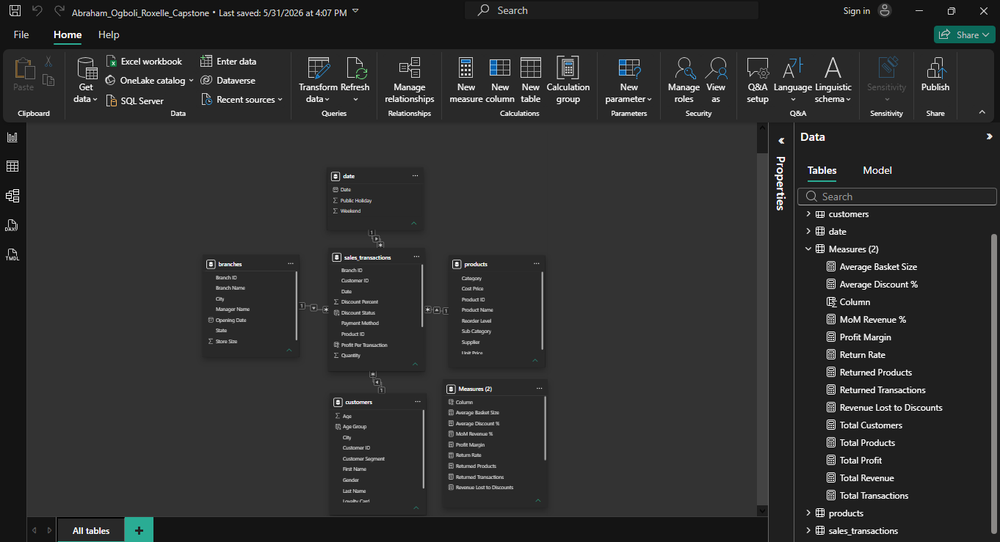
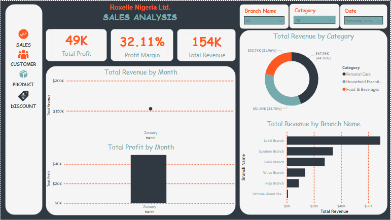
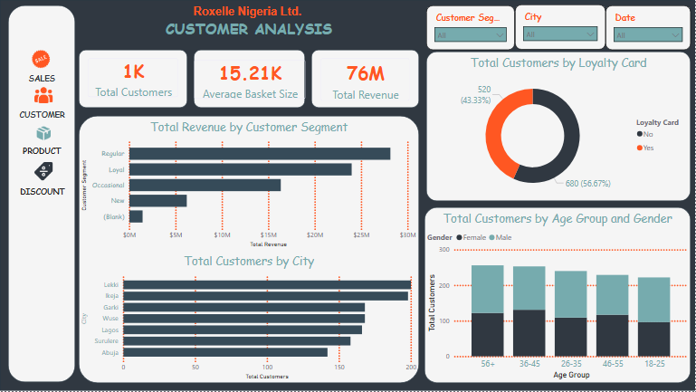
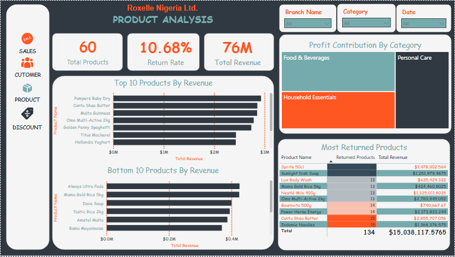
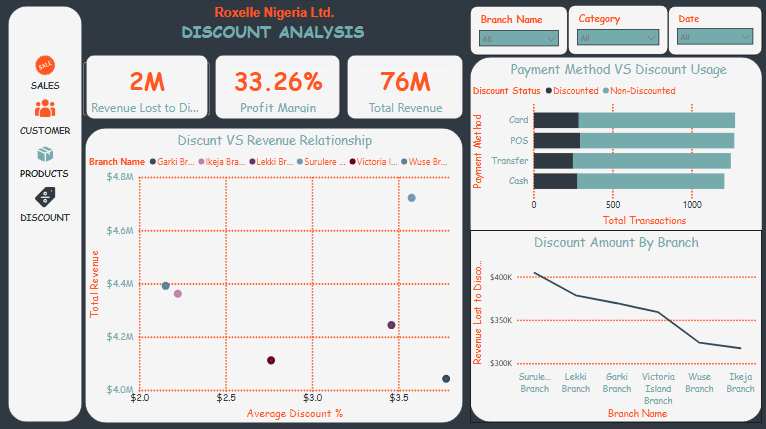

# Roxelle
Data analytics project work

Poduced by: ABRAHAM OGBOLI OSEFUMNANAYA


# ROXELLE NIGERIA LTD.  
**Sales & Operations Analytics Dashboard**

**Power BI Final Year Capstone Project**

## 1. Project Overview
This project was developed as a comprehensive Business Intelligence solution for Roxelle Nigeria Ltd. The objective was to transform raw transactional and operational data into an interactive, insightful Power BI dashboard that supports data-driven decision-making across sales, customer management, product performance, and discount optimization.

The dashboard analyzes performance across six branches located in Lagos and Abuja, providing clear visibility into key business metrics and trends.

## 2. Business Problem
Roxelle Nigeria Ltd. faced several critical challenges, including:

- Limited visibility into branch-level performance
- Uncontrolled and inconsistent discount spending
- High product return rates
- Inefficient product assortment and stocking decisions
- Lack of deep customer behaviour and segmentation insights

This Power BI solution was designed to address these challenges through interactive visualizations and actionable analytics.

## 3. Dataset Description
The analysis was built using five (5) CSV datasets:

| Dataset                | Description                                      |
|------------------------|--------------------------------------------------|
| sales_transactions     | Transaction-level sales records                  |
| customers              | Customer demographics and loyalty information    |
| products               | Product details, categories, and pricing         |
| branches               | Branch information and locations                 |
| date                   | Calendar table for time intelligence             |

## 4. Power Query Transformations
The following data preparation steps were performed in Power Query:

- Loaded all five CSV files into Power BI
- Renamed columns for better readability
- Assigned appropriate data types to all columns
- Handled null values and blanks
- Created **Revenue After Discount** calculated column
- Removed duplicate records
- Conducted data quality validation

**Revenue After Discount Formula:**
Revenue After Discount = 
Quantity × Unit Price × (1 - Discount Percent / 100)

## 5. Data Model Design

A **Star Schema** was implemented to optimize performance, simplify analysis, and improve report usability.

### Key Relationships

* Customers → Sales Transactions (1:*)
* Products → Sales Transactions (1:*)
* Branches → Sales Transactions (1:*)
* Date → Sales Transactions (1:*)

### Design Principles

* Single-direction cross-filtering was used throughout the model to improve performance and prevent filter ambiguity.
* No many-to-many relationships were implemented.
* Fact and dimension tables were separated following star schema best practices.

### Data Model Screenshot



---

## 6. DAX Measures

Several key DAX measures were developed to support business analysis and decision-making.

| Measure                   | Purpose                                 |
| ------------------------- | --------------------------------------- |
| Total Revenue             | Total revenue generated after discounts |
| Total Cost                | Total cost of products sold             |
| Total Profit              | Revenue minus cost                      |
| Profit Margin %           | Overall profitability percentage        |
| Total Transactions        | Count of distinct transactions          |
| Return Rate %             | Percentage of returned products         |
| Avg Basket Size           | Average revenue per transaction         |
| MoM Revenue %             | Month-over-month revenue growth         |
| Average Discount %        | Average discount percentage applied     |
| Revenue Lost to Discounts | Total value lost due to discounts       |

### Additional Measure Justification

**Average Discount %** was created to evaluate discount effectiveness and support the Discount Audit dashboard by monitoring promotional activity across branches.

---

## 7. Dashboard Pages

### Page 1 – Sales Performance

Focuses on:

* Total Revenue
* Total Profit
* Profit Margin
* Branch Performance
* Monthly Revenue Trends
* Category Contribution



---

### Page 2 – Customer Behaviour

Analyzes:

* Customer Segments
* Loyalty Programme Effectiveness
* Customer Demographics
* Age Group Distribution
* Geographic Distribution



---

### Page 3 – Product Performance

Highlights:

* Top Products by Revenue
* Bottom Products by Revenue
* Product Return Rates
* Category Profitability



---

### Page 4 – Discount Audit

Evaluates:

* Revenue Lost to Discounts
* Discount Distribution by Branch
* Discount Impact on Sales
* Promotional Effectiveness



---

## 8. Key Insights & Recommendations

### Key Findings

* **Surulere Branch** generated the highest revenue contribution across all branches.
* **Food & Beverages** was the strongest-performing category, contributing approximately **37.18%** of total revenue.
* Total company revenue reached approximately **₦76 Million**.
* Total profit generated was approximately **₦25 Million**.
* Overall profit margin stood at **33.26%**, indicating strong profitability.
* **Loyal Customers** emerged as the highest-value customer segment.
* The **36–45 age group** represented the largest customer demographic.
* Product return rate was **10.68%**, highlighting opportunities for product quality and inventory improvements.
* Approximately **₦2 Million** in revenue was lost through discounting activities.

### Recommendations

1. Prioritize investment and marketing efforts in high-performing categories, particularly Food & Beverages.
2. Strengthen the Loyalty Programme to improve customer retention and lifetime value.
3. Review low-performing and high-return products for possible repositioning or discontinuation.
4. Standardize discount policies across branches to minimize unnecessary revenue leakage.
5. Continue leveraging Power BI dashboards for ongoing performance monitoring and strategic decision-making.

---

## 9. Power BI Service Link

### Published Dashboard

Due to Microsoft Power BI Service organizational account requirements, the PBIX file has been provided within this repository for direct review.

If a published Power BI Service link becomes available, it will be added here.

---

## 10. Repository Contents

```text
Roxelle_Capstone/
├── datasets/
│   ├── sales_transactions.csv
│   ├── customers.csv
│   ├── products.csv
│   ├── branches.csv
│   └── date.csv
│
├── screenshots/
│   ├── sales_performance.png
│   ├── customer_behaviour.png
│   ├── product_performance.png
│   ├── discount_audit.png
│   ├── data_model.png
│   └── scheduled_refresh.png
│
├── Roxelle_Capstone.pbix
├── Project_Summary.pdf
└── README.md
```

